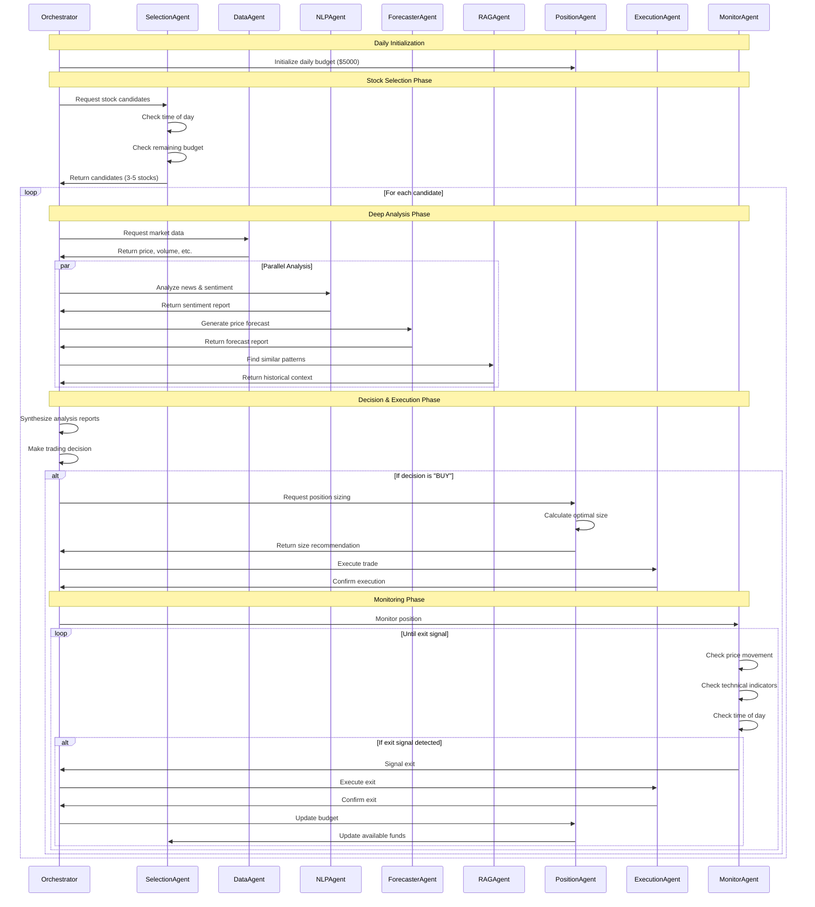

# Comprehensive MCP Integration Plan for FinGPT Trading System

## 1. System Overview

This document outlines the integration of Model Context Protocol (MCP) tools within the FinGPT AI trading system, with a focus on creating a complete day trading workflow that maintains budget awareness, time-of-day sensitivity, and risk management.

```mermaid
flowchart TD
    classDef mcpServer fill:#f9d5e5,stroke:#333,stroke-width:1px
    classDef agent fill:#e3f2fd,stroke:#333,stroke-width:1px
    classDef dataSource fill:#e8f5e9,stroke:#333,stroke-width:1px
    classDef storage fill:#fff9c4,stroke:#333,stroke-width:1px
    
    Orchestrator["AutoGen Orchestrator\n(Central Coordinator)"]
    
    subgraph Agents["AutoGen Agents"]
        SelectionAgent["Selection Agent\n(Stock Screening)"]:::agent
        DataAgent["Data Agent\n(Market Data)"]:::agent
        NLPAgent["NLP Agent\n(News & Sentiment)"]:::agent
        ForecasterAgent["Forecaster Agent\n(Price Prediction)"]:::agent
        RAGAgent["RAG Agent\n(Historical Context)"]:::agent
        PositionAgent["Position Agent\n(Risk & Sizing)"]:::agent
        ExecutionAgent["Execution Agent\n(Trade Execution)"]:::agent
        MonitorAgent["Monitor Agent\n(Performance Tracking)"]:::agent
    end
    
    subgraph MCP_Servers["MCP Tool Servers"]
        MarketDataMCP["Market Data MCP\n(Price Data, Company Info)"]:::mcpServer
        ScreeningMCP["Stock Screening MCP\n(Filter, Rank, Time-Aware)"]:::mcpServer
        SentimentMCP["Sentiment Analysis MCP\n(News, Social, Documents)"]:::mcpServer
        ForecastingMCP["Forecasting MCP\n(Predictions, Indicators)"]:::mcpServer
        PortfolioMCP["Portfolio Manager MCP\n(Position, Budget)"]:::mcpServer
        MonitoringMCP["Monitoring MCP\n(Performance, Alerts)"]:::mcpServer
        ExecutionMCP["Execution MCP\n(Order Management)"]:::mcpServer
        MemoryMCP["Memory MCP\n(Context, History)"]:::mcpServer
    end
    
    subgraph Data_Stores["Data Storage"]
        Aerospike["Aerospike\n(Real-time KV Store)"]:::storage
        TimescaleDB["TimescaleDB\n(Time Series Data)"]:::storage
        Milvus["Milvus\n(Vector Embeddings)"]:::storage
    end
    
    subgraph Data_Sources["Data Sources"]
        PolygonREST["Polygon REST API\n(Historical Data)"]:::dataSource
        PolygonWS["Polygon WebSockets\n(Real-time Data)"]:::dataSource
        AlpacaAPI["Alpaca Trading API\n(Execution)"]:::dataSource
        YahooFinance["Yahoo Finance\n(Fundamentals)"]:::dataSource
        RedditAPI["Reddit API\n(Social Sentiment)"]:::dataSource
        UnusualWhalesAPI["Unusual Whales\n(Options Flow)"]:::dataSource
    end
    
    % Core connections between components
    Orchestrator -->|coordinates| Agents
    Agents -->|use| MCP_Servers
    MCP_Servers -->|store data| Data_Stores
    Data_Sources -->|provide data| MCP_Servers
    
    % Specific data flow connections
    PolygonREST -->|historical data| MarketDataMCP
    PolygonWS -->|real-time quotes| MarketDataMCP
    YahooFinance -->|fundamentals| MarketDataMCP
    RedditAPI -->|social data| SentimentMCP
    AlpacaAPI -->|trading| ExecutionMCP
    UnusualWhalesAPI -->|unusual activity| MarketDataMCP
    
    % Storage connections
    MarketDataMCP & ScreeningMCP -->|time-series data| TimescaleDB
    SentimentMCP & RAGAgent -->|vectorized data| Milvus
    All -->|real-time state| Aerospike
    
    % Agent interactions
    SelectionAgent -->|screened stocks| DataAgent
    DataAgent -->|market data| NLPAgent & ForecasterAgent & RAGAgent
    NLPAgent & ForecasterAgent & RAGAgent -->|analysis reports| Orchestrator
    Orchestrator -->|trade decision| PositionAgent
    PositionAgent -->|sized position| ExecutionAgent
    ExecutionAgent -->|executed trade| MonitorAgent
    MonitorAgent -->|performance update| Orchestrator
    
    % Feedback loops
    MonitorAgent -->|budget updates| SelectionAgent
    ExecutionAgent -->|position updates| PortfolioMCP
```

## 2. Complete Trading Workflow

### 2.1 Stock Selection & Screening Phase

**Process Flow:**
1. The SelectionAgent initiates screening at market open & throughout day
2. ScreeningMCP applies filters based on:
   - Time of day (different strategies for morning vs. afternoon)  
   - Remaining daily budget ($5,000 total)
   - Technical criteria (volatility, volume, etc.)
3. Results fed to DataAgent for deeper analysis

**Key MCP Tools:**
```python
class ScreeningMCP:
    def screen_stocks_by_time(time_of_day: str, budget_remaining: float) -> List[Dict]:
        """
        Screen stocks based on time of day and available budget.
        
        time_of_day: 'market_open', 'mid_morning', 'lunch', 'afternoon', 'closing'
        budget_remaining: Amount available to trade
        
        Returns: List of ticker candidates with opportunity scores
        """
        # Different screening strategies based on time of day
        if time_of_day == 'market_open':
            # Focus on gap-up/down plays, high pre-market movers
            return scan_for_opening_opportunities(budget_remaining)
        elif time_of_day == 'mid_morning':
            # Look for trend continuation after initial volatility
            return scan_for_morning_trends(budget_remaining)
        elif time_of_day == 'afternoon':
            # More conservative setups, lower hold times
            return scan_for_afternoon_reversal(budget_remaining)
            
    def find_opportunities_with_budget(budget_remaining: float, max_price: float = None) -> List[Dict]:
        """Find optimal opportunities given remaining budget."""
        # Ensure we can buy minimum share quantity
        min_shares = 100
        if max_price is None:
            max_price = budget_remaining / min_shares
            
        # Apply primary filters
        candidates = filter_by_criteria({
            'max_price': max_price,
            'min_volume': 500000,
            'min_volatility': 0.01
        })
        
        # Rank opportunities
        return rank_opportunities(candidates)
```

### 2.2 Deep Analysis & Report Generation Phase

**Process Flow:**
1. For each screened candidate, three specialized agents perform analysis:
   - NLPAgent: News sentiment, social media, SEC filings
   - ForecasterAgent: Technical analysis, price projections
   - RAGAgent: Historical patterns, similar setups
2. Each agent generates a structured report
3. Reports sent to Orchestrator for final decision

**Key MCP Tools:**
```python
class SentimentMCP:
    def analyze_news_sentiment(ticker: str, lookback_days: int = 3) -> Dict:
        """Analyze sentiment from recent news articles."""
        # Fetch recent news articles
        articles = fetch_recent_news(ticker, lookback_days)
        
        # Extract and analyze sentiment
        return {
            'overall_score': calculate_sentiment_score(articles),
            'key_topics': extract_key_topics(articles),
            'sentiment_trend': analyze_sentiment_trend(articles),
            'article_count': len(articles)
        }
    
    def analyze_social_sentiment(ticker: str) -> Dict:
        """Analyze sentiment from social media sources."""
        # Get Reddit data
        reddit_data = get_reddit_sentiment(ticker)
        
        return {
            'reddit_score': reddit_data['sentiment_score'],
            'mention_count': reddit_data['mention_count'],
            'trending_status': reddit_data['trending_status'],
            'key_discussions': reddit_data['top_discussions']
        }

class ForecastingMCP:
    def generate_price_forecast(ticker: str, timeframe: str = 'intraday') -> Dict:
        """Generate price forecasts for specified timeframe."""
        # Get historical data
        hist_data = get_historical_data(ticker)
        
        # Generate forecasts using FinGPT forecaster model
        forecast = forecast_price(hist_data, timeframe)
        
        return {
            'predicted_high': forecast['high'],
            'predicted_low': forecast['low'],
            'confidence': forecast['confidence'],
            'key_levels': forecast['support_resistance']
        }
    
    def identify_technical_signals(ticker: str) -> Dict:
        """Identify technical trading signals."""
        # Calculate technical indicators
        indicators = calculate_indicators(ticker)
        
        # Identify patterns and signals
        signals = identify_patterns(indicators)
        
        return {
            'bullish_signals': signals['bullish'],
            'bearish_signals': signals['bearish'],
            'overall_bias': signals['bias'],
            'signal_strength': signals['strength']
        }

class MemoryMCP:
    def find_similar_historical_patterns(ticker: str, current_setup: Dict) -> Dict:
        """Find similar historical patterns and outcomes."""
        # Vectorize current setup
        setup_vector = vectorize_market_setup(current_setup)
        
        # Search vector DB for similar patterns
        similar_setups = search_similar_setups(setup_vector)
        
        return {
            'similar_events': similar_setups,
            'historical_outcomes': analyze_outcomes(similar_setups),
            'win_rate': calculate_win_rate(similar_setups),
            'avg_profit_loss': calculate_avg_pl(similar_setups)
        }
```

### 2.3 Decision Making & Position Sizing Phase

**Process Flow:**
1. Orchestrator evaluates all analysis reports
2. If decision is "buy", PositionAgent determines position size
3. Position size based on:
   - Remaining budget
   - Risk metrics from analysis
   - Maximum risk per trade (1% of daily budget)
4. Final trade parameters sent to ExecutionAgent

**Key MCP Tools:**
```python
class PortfolioMCP:
    def calculate_position_size(
        ticker: str, 
        entry_price: float,
        stop_price: float,
        remaining_budget: float,
        confidence_score: float,
        max_risk_percent: float = 0.01
    ) -> Dict:
        """
        Calculate optimal position size based on risk parameters.
        
        max_risk_percent: Maximum risk per trade (1% = 0.01)
        """
        # Calculate risk amount ($)
        max_risk_amount = remaining_budget * max_risk_percent
        
        # Calculate per-share risk ($)
        per_share_risk = abs(entry_price - stop_price)
        
        # Calculate risk-based position size
        risk_based_shares = int(max_risk_amount / per_share_risk)
        
        # Budget constraint
        budget_based_shares = int(remaining_budget / entry_price)
        
        # Take the lower value
        final_shares = min(risk_based_shares, budget_based_shares)
        
        # Adjust based on confidence
        adjusted_shares = int(final_shares * confidence_score)
        
        return {
            "ticker": ticker,
            "recommended_shares": adjusted_shares,
            "estimated_cost": adjusted_shares * entry_price,
            "max_risk_amount": max_risk_amount,
            "per_share_risk": per_share_risk,
            "remaining_after_trade": remaining_budget - (adjusted_shares * entry_price)
        }
    
    def get_trading_parameters(ticker: str, analysis_reports: Dict) -> Dict:
        """
        Convert analysis reports into actual trading parameters.
        """
        # Extract key parameters from reports
        sentiment = analysis_reports['sentiment']['overall_score']
        forecast = analysis_reports['forecast']
        technical = analysis_reports['technical']
        historical = analysis_reports['historical']
        
        # Calculate entry and exit points
        entry_price = forecast['current_price']
        stop_loss = calculate_stop_loss(entry_price, technical, historical)
        take_profit = calculate_take_profit(entry_price, forecast, historical)
        
        # Calculate confidence score (0.0-1.0)
        confidence = calculate_confidence_score(sentiment, technical, historical)
        
        return {
            "ticker": ticker,
            "entry_price": entry_price,
            "stop_loss": stop_loss,
            "take_profit": take_profit,
            "confidence": confidence,
            "time_horizon": estimate_time_horizon(technical, historical)
        }
```

### 2.4 Trade Execution & Monitoring Phase

**Process Flow:**
1. ExecutionAgent sends trade to Alpaca via ExecutionMCP
2. MonitorAgent actively monitors the position:
   - Price movement relative to target & stop
   - Technical indicators for exit signals
   - Volatility and volume changes
3. Exit decisions triggered by:
   - Stop loss hit
   - Take profit hit
   - Technical exit signal
   - End of trading day approach (no overnight)
4. Budget updated after exit, fed back to SelectionAgent

**Key MCP Tools:**
```python
class ExecutionMCP:
    def place_order(
        ticker: str,
        side: str,  # 'buy' or 'sell'
        quantity: int,
        order_type: str = 'market',
        limit_price: float = None,
        stop_price: float = None
    ) -> Dict:
        """Place an order with the broker (Alpaca)."""
        # Connect to Alpaca API
        alpaca = connect_to_alpaca()
        
        # Place the order
        order = alpaca.submit_order(
            symbol=ticker,
            qty=quantity,
            side=side,
            type=order_type,
            limit_price=limit_price,
            stop_price=stop_price
        )
        
        return {
            "order_id": order.id,
            "ticker": ticker,
            "side": side,
            "quantity": quantity,
            "status": order.status,
            "filled_at": order.filled_at,
            "filled_price": order.filled_avg_price if order.filled_avg_price else None
        }
        
    def get_current_positions() -> List[Dict]:
        """Get current open positions."""
        # Connect to Alpaca API
        alpaca = connect_to_alpaca()
        
        # Get positions
        positions = alpaca.list_positions()
        
        return [{
            "ticker": pos.symbol,
            "quantity": int(pos.qty),
            "entry_price": float(pos.avg_entry_price),
            "current_price": float(pos.current_price),
            "current_value": float(pos.market_value),
            "unrealized_pl": float(pos.unrealized_pl),
            "unrealized_plpc": float(pos.unrealized_plpc)
        } for pos in positions]

class MonitoringMCP:
    def monitor_position(
        ticker: str,
        entry_price: float,
        stop_loss: float,
        take_profit: float
    ) -> Dict:
        """
        Actively monitor a position and generate exit signals.
        Returns continuously updated monitoring data.
        """
        # Get real-time data (using Polygon WebSockets)
        real_time = get_real_time_data(ticker)
        
        # Calculate metrics
        price = real_time['price']
        distance_to_stop = (price - stop_loss) / entry_price
        distance_to_target = (take_profit - price) / entry_price
        
        # Check for exit conditions
        exit_signals = []
        
        if price <= stop_loss:
            exit_signals.append("stop_loss_hit")
            
        if price >= take_profit:
            exit_signals.append("take_profit_hit")
        
        # Check technical exit signals
        if detect_bearish_reversal(ticker):
            exit_signals.append("bearish_reversal")
        
        # Check time-based exit (approaching end of day)
        if is_approaching_market_close():
            exit_signals.append("approaching_market_close")
        
        return {
            "ticker": ticker,
            "current_price": price,
            "change_percent": (price - entry_price) / entry_price * 100,
            "distance_to_stop": distance_to_stop,
            "distance_to_target": distance_to_target,
            "exit_signals": exit_signals,
            "should_exit": len(exit_signals) > 0
        }
    
    def detect_price_drift(ticker: str, window_size: int = 20) -> Dict:
        """
        Detect abnormal price drift or slippage.
        """
        # Get recent tick data
        ticks = get_recent_ticks(ticker, window_size)
        
        # Calculate normal range
        avg_spread = calculate_avg_spread(ticks)
        expected_range = calculate_expected_range(ticks)
        
        # Detect abnormalities
        slippage = detect_slippage(ticks, avg_spread)
        drift = detect_drift(ticks, expected_range)
        
        return {
            "ticker": ticker,
            "avg_spread": avg_spread,
            "abnormal_slippage": slippage > avg_spread * 2,
            "slippage_amount": slippage,
            "abnormal_drift": drift > expected_range * 3,
            "drift_amount": drift
        }
```

## 3. Data Infrastructure & Integration

### 3.1 Data Storage Recommendations

Instead of using Redis and InfluxDB, we recommend:

#### Aerospike for Real-time State Management
- **Advantages**:
  - Ultra-low latency (<1ms)
  - High throughput for trading data
  - Hybrid memory/SSD storage
  - Better persistence than Redis
  - Multi-threaded, async operations
- **Use Cases**:
  - State management
  - Real-time market data caching
  - Position tracking
  - Intraday analytics

#### TimescaleDB for Time-Series Data
- **Advantages**:
  - PostgreSQL compatible
  - Superior query performance vs. InfluxDB
  - Handles both time-series and relational data
  - Better indexing for financial time-series
  - SQL interface (easier to query)
- **Use Cases**:
  - Market data storage
  - Performance metrics
  - Trading logs
  - Backtesting data

#### Milvus for Vector Embeddings
- **Advantages**:
  - High-performance vector search
  - Dynamic schema (good for evolving data)
  - Scalable for large datasets
  - GPU acceleration
- **Use Cases**:
  - Sentiment embeddings
  - Similar pattern recognition
  - Market setup classification
  - News categorization

### 3.2 Data Source Integration Strategy

#### REST API vs WebSocket Usage

```mermaid
flowchart TB
    classDef restApi fill:#e3f2fd,stroke:#333,stroke-width:1px
    classDef websocket fill:#f9d5e5,stroke:#333,stroke-width:1px
    
    subgraph PolygonREST["Polygon REST API"]:::restApi
        direction TB
        PR1["Historical Data"]
        PR2["Reference Data"]
        PR3["Fundamentals"]
        PR4["Market Indices"]
    end
    
    subgraph PolygonWS["Polygon WebSocket"]:::websocket
        direction TB
        PW1["Real-time Quotes"]
        PW2["Trade Updates"]
        PW3["OHLC Updates"]
    end
    
    subgraph UseCases["System Components"]
        direction TB
        UC1["Initial Screening"]
        UC2["Historical Analysis"]
        UC3["Real-time Monitoring"]
        UC4["Exit Signal Detection"]
    end
    
    PR1 --> UC1 & UC2
    PR2 & PR3 --> UC2
    PR4 --> UC1
    
    PW1 & PW2 & PW3 --> UC3 & UC4
```

- **REST API Usage**:
  - Historical data gathering (daily, hourly candles)
  - Company fundamentals
  - Initial stock screening
  - Market reference data
  - End-of-day analysis

- **WebSocket Usage**:
  - Real-time price monitoring
  - Exit signal detection
  - Slippage monitoring
  - Live technical indicators
  - Up-to-the-second decision making

### 3.3 Integration with FinGPT Models

Each MCP tool will leverage the corresponding FinGPT model:

1. **Sentiment Analysis MCP → fingpt_finnlp**
   - MCP tools wrap the NLP model functionality
   - Tools handle data preprocessing and results formatting
   - direct connection to the trained model

2. **Forecasting MCP → fingpt_forcaster**
   - Tools implement model inference for price predictions
   - Historical data preparation and normalization
   - Prediction result interpretation

3. **Selection MCP → fingpt_selection**
   - Stock screening algorithms powered by selection model
   - Real-time filtering and ranking
   - Budget-aware candidate generation

4. **Execution MCP → fingpt_order + fingpt_execution**
   - Trade execution logic with model-based optimization
   - Order placement and management
   - Position monitoring and exit decision support

## 4. Detailed MCP Tool Specifications

### 4.1 MarketDataMCP Server

**Purpose**: Centralized access to all market data sources

**Tools**:
```python
def get_stock_price(ticker: str) -> Dict
def get_historical_data(ticker: str, period: str, interval: str) -> Dict
def get_company_info(ticker: str) -> Dict
def get_options_chain(ticker: str) -> Dict
def stream_real_time_quotes(ticker: str, callback: callable) -> None
def get_unusual_activity(ticker: str) -> Dict
def get_market_indices() -> Dict
def get_sector_performance() -> Dict
```

**Integration with Data Sources**:
- Polygon.io REST API for historical and reference data
- Polygon.io WebSockets for real-time market data
- Yahoo Finance API for additional fundamentals and analysis
- Unusual Whales API for options flow and unusual activity

**Storage Strategy**:
- Real-time quotes → Aerospike (in-memory with persistence)
- Historical data → TimescaleDB (optimized time-series)
- Company information → TimescaleDB (relational tables)

### 4.2 ScreeningMCP Server

**Purpose**: Smart stock screening with time and budget awareness

**Tools**:
```python
def screen_stocks_by_time(time_of_day: str, budget_remaining: float) -> List[Dict]
def find_opportunities_with_budget(budget_remaining: float, max_price: float = None) -> List[Dict]
def scan_for_day_trade_setups(pattern_types: List[str]) -> List[Dict]
def filter_by_criteria(criteria: Dict) -> List[Dict]
def rank_opportunities(candidates: List[Dict], strategy: str = "day_trade") -> List[Dict]
```

**Time-of-Day Awareness**:
- Different screening strategies for different market phases:
  - Market Open (9:30-10:30): Gap plays, earnings reactions
  - Mid-Morning (10:30-12:00): Trend continuation setups
  - Lunch (12:00-13:30): Range-bound strategies
  - Afternoon (13:30-15:00): Reversal setups
  - Closing Hour (15:00-16:00): Conservative day-end plays

**Budget Awareness**:
- Dynamically adjusts screening parameters based on remaining budget:
  - Lower budget → Focus on lower-priced stocks
  - Higher budget → More flexibility in stock selection
  - Considers minimum position sizes (e.g., 100 shares minimum)
  - Prioritizes opportunities with optimal risk/reward for budget

### 4.3 SentimentMCP Server

**Purpose**: Comprehensive sentiment analysis from multiple sources

**Tools**:
```python
def analyze_news_sentiment(ticker: str, lookback_days: int = 3) -> Dict
def analyze_social_sentiment(ticker: str) -> Dict
def extract_key_topics(ticker: str) -> List[Dict]
def get_sec_filings_summary(ticker: str) -> Dict
def get_analyst_ratings(ticker: str) -> Dict
def get_sentiment_trend(ticker: str, days: int = 30) -> Dict
```

**Integration with FinGPT Models**:
- Uses `fingpt_finnlp` model for:
  - News sentiment scoring
  - Key topic extraction
  - Document summarization
  - Trend analysis

**Storage Strategy**:
- News articles and preprocessed text → TimescaleDB
- Vectorized sentiment → Milvus
- Sentiment time series → TimescaleDB
- Real-time sentiment updates → Aerospike

### 4.4 ForecastingMCP Server

**Purpose**: Price prediction and technical analysis

**Tools**:
```python
def generate_price_forecast(ticker: str, timeframe: str = "intraday") -> Dict
def identify_technical_signals(ticker: str) -> Dict
def calculate_indicators(ticker: str, indicator_list: List[str] = None) -> Dict
def detect_support_resistance(ticker: str) -> Dict
def predict_volatility(ticker: str) -> Dict
def identify_trend_strength(ticker: str) -> Dict
```

**Integration with FinGPT Models**:
- Uses `fingpt_forcaster` model for:
  - Price trend prediction
  - Volatility forecasting
  - Support/resistance identification
  - Pattern recognition

**Storage Strategy**:
- Historical forecasts → TimescaleDB
- Real-time indicators → Aerospike
- Technical patterns → Milvus (vector similarity)

### 4.5 PortfolioMCP Server

**Purpose**: Portfolio management and position sizing

**Tools**:
```python
def calculate_position_size(ticker: str, entry_price: float, stop_price: float, remaining_budget: float, confidence_score: float) -> Dict
def get_available_buying_power() -> float
def get_daily_allocation_remaining() -> float
def get_trading_parameters(ticker: str, analysis_reports: Dict) -> Dict
def update_budget_after_trade(trade_result: Dict) -> Dict
def get_portfolio_risk() -> Dict
def get_open_positions() -> List[Dict]
```

**Key Features**:
- Maintains real-time awareness of:
  - Daily budget allocation ($5,000)
  - Remaining funds
  - Open positions and their status
  - Risk exposure
- Dynamic position sizing based on:
  - Stop loss distance
  - Account risk parameters (1% max risk per trade)
  - Confidence in setup
  - Time of day (smaller positions later in day)

### 4.6 ExecutionMCP Server

**Purpose**: Order placement and management

**Tools**:
```python
def place_order(ticker: str, side: str, quantity: int, order_type: str = "market") -> Dict
def modify_order(order_id: str, params: Dict) -> Dict
def cancel_order(order_id: str) -> Dict
def get_order_status(order_id: str) -> Dict
def get_current_positions() -> List[Dict]
def place_bracket_order(ticker: str, quantity: int, stop_loss: float, take_profit: float) -> Dict
```

**Integration Points**:
- Connects directly to Alpaca trading API
- Reports trade executions to Orchestrator
- Updates PortfolioMCP with new positions
- Provides real-time order status updates

### 4.7 MonitoringMCP Server

**Purpose**: Position monitoring and exit signal detection

**Tools**:
```python
def monitor_position(ticker: str, entry_price: float, stop_loss: float, take_profit: float) -> Dict
def detect_price_drift(ticker: str, window_size: int = 20) -> Dict
def detect_exit_signals(ticker: str, strategy: str = "day_trade") -> List[str]
def track_performance_metrics() -> Dict
def check_market_conditions() -> Dict
def monitor_volatility_changes(ticker: str) -> Dict
```

**Real-time Monitoring Features**:
- Continuous monitoring of active positions
- Detection of abnormal price movement (slippage, drift)
- Technical indicator calculation for exit signals
- Time-based monitoring (approaching end of day)
- Performance tracking and analytics

### 4.8 MemoryMCP Server

**Purpose**: Historical context and pattern recognition

**Tools**:
```python
def store_market_setup(ticker: str, setup_data: Dict, outcome: Dict = None) -> str
def find_similar_historical_patterns(ticker: str, current_setup: Dict) -> Dict
def update_setup_outcome(setup_id: str, outcome: Dict) -> Dict
def get_trading_history(ticker: str = None, days: int = 30) -> List[Dict]
def get_similar_stocks(ticker: str, fundamentals: bool = True, technicals: bool = True) -> List[Dict]
```

**Key Features**:
- Maintains vector database of market setups
- Allows semantic similarity search for current conditions
- Learns from past trading outcomes
- Provides historical context for decision making
- Enables comparison of current setup to past winners/losers

## 5. Complete Trading Workflow Example



### Example Stock Tracking:

1. **9:45 AM: Initial Screening**
   - ScreeningMCP identifies AAPL as candidate (morning gapper)
   - Available budget: $5,000
   - Expected holding period: 1-3 hours

2. **9:50 AM: Deep Analysis**
   - SentimentMCP: Positive news (new product announcement)
   - ForecastingMCP: Bullish forecast (target +1.5%)
   - MemoryMCP: Similar patterns show 67% win rate

3. **9:55 AM: Decision & Sizing**
   - Decision: Buy
   - Entry price: $205.50
   - Stop loss: $204.00 (based on support level)
   - Take profit: $208.00 (based on forecast)
   - Position size: 100 shares ($20,550)
   - Risk amount: $150 (within 1% of $5,000 daily allotment)

4. **10:00 AM: Execution & Monitoring**
   - Order executed at $205.60
   - MonitoringMCP begins real-time tracking
   - Remaining budget: $4,794.40

5. **10:45 AM: Active Monitoring**
   - Current price: $206.80
   - Up 0.6% from entry
   - No exit signals yet
   - No abnormal drift or slippage

6. **11:30 AM: Exit Signal**
   - Price reaches $207.90 (near target)
   - Technical indicators show momentum slowing
   - Decision: Sell
   - Exit executed at $207.85
   - Profit: $225 (1.1% gain)
   - Updated budget: $5,019.40

7. **11:35 AM: Feedback Loop**
   - Trade recorded in MemoryMCP
   - Updated budget sent to ScreeningMCP
   - System begins scanning for next opportunity
   - SelectionAgent adjusts criteria based on time of day

## 6. Implementation Timeline

1. **Phase 1: Core Data Infrastructure** (2 weeks)
   - Set up Aerospike, TimescaleDB, and Milvus
   - Implement MarketDataMCP with Polygon.io integration
   - Create data ingestion pipelines

2. **Phase 2: Stock Selection & Analysis** (2 weeks)
   - Implement ScreeningMCP with time-of-day awareness
   - Connect SentimentMCP to news and social sources
   - Build ForecastingMCP and integration with fingpt_forecaster

3. **Phase 3: Execution & Monitoring** (2 weeks)
   - Implement PortfolioMCP with budget management
   - Build ExecutionMCP with Alpaca integration
   - Create MonitoringMCP with real-time tracking

4. **Phase 4: Memory & Learning** (1 week)
   - Implement MemoryMCP for historical context
   - Create outcome tracking and feedback loops
   - Build vector database for similar pattern matching

5. **Phase 5: Orchestrator Enhancement** (2 weeks)
   - Update AutoGen Orchestrator to incorporate all MCP tools
   - Implement complete trading workflow
   - Add time-of-day awareness to all components

6. **Phase 6: Testing & Optimization** (1 week)
   - Simulated trading with live data
   - Performance optimization
   - System hardening