# Plan: How to Customize or Extend FinGPT for Your Use Case

## 1. Overview

FinGPT is designed as a modular, event-driven AI trading system. Its architecture allows for easy customization and extension at multiple points, including data ingestion, analysis, decision-making, and execution.

---

## 2. Main Extension Points

### a. Data Ingestion Layer
- **Add new data sources** (APIs, files, web scraping).
- Extend or modify data connectors in `data/` (e.g., add `data/my_new_source.py`).

### b. Stock Selection Layer
- **Customize filtering logic** in `fingpt/fingpt_selection/selection_model.py`.
- Add new screening criteria (technical, fundamental, sentiment).

### c. Analysis Layer
- **Integrate new models** (NLP, forecasting, RAG).
- Add or modify modules in `fingpt/fingpt_finnlp/`, `fingpt/fingpt_forcaster/`, `fingpt/fingpt_rag/`.
- Fine-tune or swap out LLMs (see `fingpt/fingpt_lora/`).

### d. Decision Layer (Orchestrator)
- **Change orchestration logic** in `fingpt/fingpt_orchestrator/orchestrator_model.py`.
- Implement new decision strategies or combine additional analysis results.

### e. Execution Layer
- **Add new execution strategies** in `fingpt/fingpt_execution/execution_model.py`.
- Integrate with other brokers by adding modules like `alpaca/alpaca_api.py`.

### f. Monitoring & Benchmarking
- **Add new metrics or logging** in `prometheus/`, `loki/`, or `fingpt/fingpt_bench/`.

---

## 3. Typical Customization Scenarios

### Scenario 1: Add a New Data Source
1. Create a new connector in `data/` (e.g., `data/my_new_source.py`).
2. Implement data fetching, normalization, and error handling.
3. Register the new source in the orchestrator and/or selection logic.

### Scenario 2: Add a Custom Model (e.g., Sentiment, Forecasting)
1. Add your model code to the relevant module (e.g., `fingpt/fingpt_finnlp/my_sentiment_model.py`).
2. Update the orchestrator to call your model and use its output in decision-making.

### Scenario 3: Change Trading Strategy
1. Modify or extend `fingpt/fingpt_orchestrator/orchestrator_model.py` to implement new logic.
2. Optionally, update execution and order management modules for new risk or sizing rules.

### Scenario 4: Integrate with a New Broker
1. Add a new broker API client (e.g., `mybroker/mybroker_api.py`).
2. Update execution logic to support the new broker.

---

## 4. Mermaid Diagram: Customization Points

```mermaid
flowchart TD
    A[Data Ingestion Layer] -->|Custom Data Source| A1[data/my_new_source.py]
    B[Stock Selection Layer] -->|Custom Filter| B1[fingpt_selection/selection_model.py]
    C[Analysis Layer] -->|Custom Model| C1[fingpt_finnlp/my_sentiment_model.py]
    C -->|Custom Forecaster| C2[fingpt_forcaster/my_forecaster.py]
    D[Decision Layer] -->|Custom Logic| D1[fingpt_orchestrator/orchestrator_model.py]
    E[Execution Layer] -->|Custom Strategy| E1[fingpt_execution/execution_model.py]
    E -->|New Broker| E2[mybroker/mybroker_api.py]
    F[Monitoring] -->|Custom Metrics| F1[prometheus/prometheus_manager.py]
    F -->|Custom Logging| F2[loki/loki_manager.py]
```

---

## 5. Step-by-Step Guide

1. **Identify your customization goal** (data, model, strategy, broker, etc.).
2. **Locate the relevant module** in the codebase (see above).
3. **Implement your changes** (new Python file or edit existing).
4. **Update the orchestrator** if your component needs to be integrated into the main workflow.
5. **Test your changes** using historical data or in a sandbox environment.
6. **Monitor system logs and metrics** to verify correct integration.

---

## 6. References

- [SYSTEM_ARCHITECTURE.md](SYSTEM_ARCHITECTURE.md)
- [README.md](../README.md)
- [FinGPT GitHub](https://github.com/AI4Finance-Foundation/FinGPT)

---

## 7. Tips

- Use environment variables in `.env` for new API keys or configuration.
- Follow the modular design—add new files rather than modifying core logic when possible.
- Use the event-driven messaging (Redis) for communication between new and existing components.

---