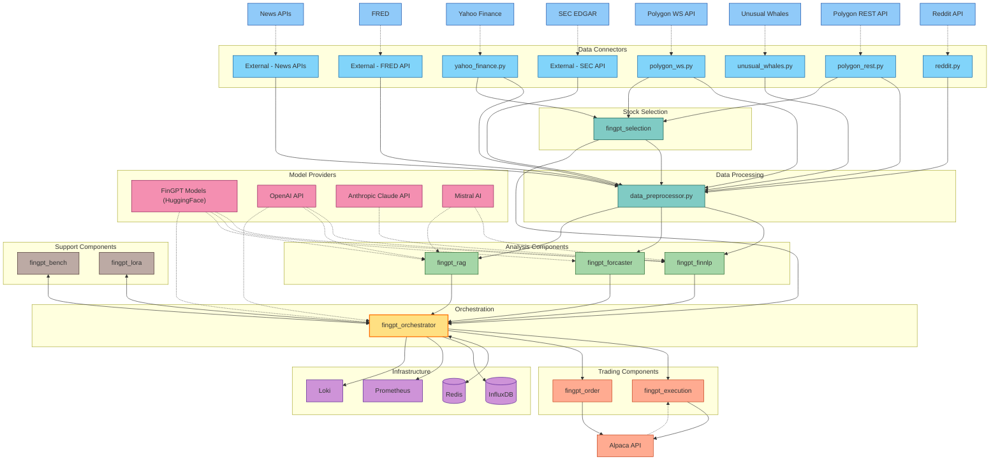

# FinGPT AI Day Trading System Flow

This document visualizes the complete system flow of the FinGPT AI Day Trading System, showing how data and control flow through the various components.

## Complete System Flow Diagram

## Event Flow Sequence

The system operates through the following event flow sequence:

1. **Market Data Collection**
   - Data connectors retrieve data from external sources
   - Real-time and historical data streams are processed

2. **Stock Universe Generation and Filtering**
   - `fingpt_selection` creates the initial trading universe
   - Applies multi-tier filtering with both rules and LLM intelligence
   - Selected candidates are passed to data preprocessor

3. **Data Preprocessing**
   - `data_preprocessor.py` normalizes and prepares data for analysis
   - Creates feature vectors and technical indicators
   - Formats data for model consumption

4. **Multi-faceted Analysis**
   - `fingpt_finnlp` analyzes financial texts and sentiment
   - `fingpt_forcaster` generates price predictions
   - `fingpt_rag` provides historical context and precedents

5. **Decision Orchestration**
   - `fingpt_orchestrator` integrates all analysis results
   - Applies portfolio constraints and risk management rules
   - Makes final trading decisions

6. **Trade Execution and Management**
   - `fingpt_execution` determines position sizing and execution strategy
   - `fingpt_order` manages order lifecycle and monitors positions
   - Trades are submitted to Alpaca for execution

7. **Performance Analysis and Adaptation**
   - `fingpt_bench` evaluates trading performance
   - `fingpt_lora` adapts models based on performance feedback
   - System parameters are adjusted based on market conditions

## Event Bus Architecture

The Redis message bus enables event-driven communication between components:

- **Market Events**: Price changes, economic announcements, news events
- **System Events**: Component status, error conditions, performance metrics
- **Trading Events**: Order execution, position changes, P&L updates
- **Analysis Events**: New sentiment scores, prediction updates, pattern detections

Each component both produces and consumes events according to its role in the system, creating a responsive and adaptable trading architecture.

## Data Flow Rates

| Component Connection | Typical Data Rate | Update Frequency |
|----------------------|-------------------|------------------|
| Market Data → System | 5-50 MB/min | Real-time (ms) to 15-min |
| Selection → Preprocessor | 100-500 KB/event | 15-60 min |
| Analysis → Orchestrator | 10-50 KB/event | 1-15 min |
| Orchestrator → Execution | 1-5 KB/event | 1-15 min |
| System → Monitoring | 100-500 KB/min | Continuous |
