# NextGen AI Trading System Flow

This document visualizes the complete system flow of the NextGen AI Trading System, showing how data and control flow through the various components.

## Complete System Flow Diagram

```mermaid
graph TD
    %% Define external data sources
    DS1[Polygon REST API] -.-> DR1
    DS2[Polygon WS API] -.-> DR1
    DS3[Yahoo Finance] -.-> DR1
    DS4[Reddit API] -.-> DR1
    DS5[Unusual Whales] -.-> DR1
    DS6[Alpaca API] -.-> TR1
    DS7[OpenRouter] -.-> OR1
    DS8[ChromaDB] -.-> VS1
    
    %% Consolidated MCP Tools
    subgraph "Consolidated MCP Tools"
        DR1[financial_data_mcp.py]
        DA1[document_analysis_mcp.py]
        RA1[risk_analysis_mcp.py]
        TS1[time_series_mcp.py]
        TR1[trading_mcp.py]
        VS1[vector_store_mcp.py]
    end
    
    %% Core Models
    subgraph "NextGen Models"
        SS1[nextgen_select]
        AC1[nextgen_sentiment_analysis]
        AC2[nextgen_market_analysis]
        AC3[nextgen_context_model]
        AC4[nextgen_fundamental_analysis]
        AC5[nextgen_risk_assessment]
        DM1[nextgen_decision]
        TR2[nextgen_trader]
    end
    
    %% Orchestration
    subgraph "Orchestration"
        OR1[autogen_orchestrator]
    end
    
    %% Infrastructure
    subgraph "Infrastructure"
        IN1[(Redis)]
        IN2[(ChromaDB)]
        IN3[System Monitor]
    end
    
    %% Model Providers via OpenRouter
    subgraph "LLM Providers via OpenRouter"
        MP1["Claude 3 Opus"]
        MP2["Llama 3 70B"]
        MP3["Gemini Pro"]
    end
    
    %% Flow connections for data sources to MCP tools
    DR1 <--> DS1
    DR1 <--> DS2
    DR1 <--> DS3
    DR1 <--> DS4
    DR1 <--> DS5
    TR1 <--> DS6
    VS1 <--> DS8
    
    %% Core model connections to MCP tools
    SS1 --> DR1
    SS1 --> TS1
    
    AC1 --> DR1
    
    AC2 --> DR1
    AC2 --> TS1
    AC2 --> RA1
    
    AC3 --> VS1
    AC3 --> DA1
    AC3 --> IN2
    
    AC4 --> DR1
    
    AC5 --> RA1
    AC5 --> TS1
    
    TR2 --> TR1
    TR2 --> RA1
    TR2 --> TS1
    
    %% Orchestration connections
    OR1 --> SS1
    OR1 --> AC1
    OR1 --> AC2
    OR1 --> AC3
    OR1 --> AC4
    OR1 --> AC5
    OR1 --> DM1
    OR1 --> TR2
    
    %% Decision model connections
    DM1 --> SS1
    DM1 --> AC1
    DM1 --> AC2
    DM1 --> AC3
    DM1 --> AC4
    DM1 --> AC5
    DM1 --> TR2
    DM1 --> RA1
    
    %% Infrastructure connections
    IN1 <--> DR1
    IN1 <--> TR1
    IN1 <--> SS1
    IN1 <--> AC1
    IN1 <--> AC2
    IN1 <--> AC3
    IN1 <--> AC4
    IN1 <--> AC5
    IN1 <--> DM1
    IN1 <--> TR2
    IN1 <--> OR1
    
    IN2 <--> AC3
    IN2 <--> VS1
    
    IN3 --> SS1
    IN3 --> AC1
    IN3 --> AC2
    IN3 --> AC3
    IN3 --> AC4
    IN3 --> AC5
    IN3 --> DM1
    IN3 --> TR2
    IN3 --> OR1
    
    %% LLM connections
    MP1 -.-> OR1
    MP2 -.-> OR1
    MP3 -.-> OR1
    
    %% Style definitions
    classDef dataSource fill:#90CAF9,stroke:#0D47A1,stroke-width:1px;
    classDef dataConnector fill:#81D4FA,stroke:#01579B,stroke-width:1px;
    classDef analysisTools fill:#80CBC4,stroke:#004D40,stroke-width:1px;
    classDef model fill:#A5D6A7,stroke:#1B5E20,stroke-width:1px;
    classDef orchestration fill:#FFE082,stroke:#FF6F00,stroke-width:2px;
    classDef infrastructure fill:#CE93D8,stroke:#4A148C,stroke-width:1px;
    classDef llm fill:#F48FB1,stroke:#880E4F,stroke-width:1px;
    
    %% Apply styles
    class DS1,DS2,DS3,DS4,DS5,DS6,DS7,DS8 dataSource;
    class DR1,DA1,RA1,TS1,TR1,VS1,FT1 dataConnector;
    class SS1,AC1,AC2,AC3,AC4,AC5,DM1,TR2 model;
    class OR1 orchestration;
    class IN1,IN2,IN3 infrastructure;
    class MP1,MP2,MP3 llm;
```

## Event Flow Sequence

The system operates through the following event flow sequence:

1. **Market Data Collection**
   - Financial Data MCP retrieves data from external sources
   - Data is normalized and cached in Redis
   - Real-time streams are processed via WebSocket connections

2. **Stock Universe Generation and Filtering**
   - `nextgen_select` creates the initial trading universe
   - Multi-tier filtering applied using Time Series MCP
   - Selected candidates are stored in Redis for other components

3. **Multi-faceted Analysis**
   - `nextgen_sentiment_analysis` processes news and social media using Financial Data MCP
   - `nextgen_market_analysis` generates price predictions using Time Series MCP
   - `nextgen_context_model` retrieves relevant historical context using Vector Store MCP (ChromaDB)
   - `nextgen_fundamental_analysis` evaluates company financials
   - `nextgen_risk_assessment` calculates risk metrics using Risk Analysis MCP

4. **Decision Orchestration**
   - `nextgen_decision` integrates all analysis results
   - Applies portfolio constraints and risk management rules
   - Makes final trading decisions
   - Sends trade instructions to trade model

5. **Trade Execution and Management**
   - `nextgen_trader` determines execution strategy
   - Connects to Alpaca via Trading MCP for order execution
   - Monitors positions and manages risk
   - Uses Risk Analysis MCP to evaluate execution quality

6. **Agent Coordination**
   - `autogen_orchestrator` coordinates specialized agents
   - Manages LLM access via OpenRouter
   - Provides MCP tool access to agents
   - Handles complex multi-agent workflows

7. **System Monitoring**
   - `system_monitor` tracks component performance
   - Logs events and metrics
   - Alerts on error conditions
   - Provides visibility into system operation

## Redis Event Bus Architecture

The Redis message bus enables event-driven communication between components:

- **Market Events**: Price changes, economic announcements, news events
- **System Events**: Component status, error conditions, performance metrics
- **Trading Events**: Order execution, position changes, P&L updates
- **Analysis Events**: New sentiment scores, prediction updates, pattern detections

Redis streams are used for persistent event publishing and subscription, allowing components to process events asynchronously.

## Consolidated MCP Tool Integration

Model Context Protocol (MCP) consolidates tools into logical groups for improved organization:

- **Financial Data MCP**: Consolidates all market data access (Polygon, Yahoo Finance, Reddit, Unusual Whales) and financial text analysis capabilities
- **Document Analysis MCP**: Consolidates document processing, embeddings, query reformulation, and relevance feedback
- **Risk Analysis MCP**: Consolidates portfolio optimization, risk attribution, and confidence scoring
- **Time Series MCP**: Consolidates technical indicators, peak detection, and pattern analysis
- **Trading MCP**: Consolidates order execution and position management
- **Vector Store MCP**: Provides ChromaDB integration for vector storage and similarity search

This consolidated architecture improves maintainability and reduces code duplication while maintaining a consistent interface for models to access external capabilities.

## AutoGen Agent Architecture

Microsoft's AutoGen framework enables multi-agent collaboration:

- **Specialized Agents**: Each agent has expertise in a specific domain
- **Group Chat**: Agents collaborate in group chats to solve problems
- **Tool Access**: Agents access consolidated MCP tools through registered functions
- **Function Registration**: System functions are registered with appropriate agents
- **Orchestration**: Manager agents direct conversation flow

This architecture allows for complex reasoning across multiple domains, with each agent bringing specialized capabilities to the system.

## RAG Implementation with ChromaDB

The Context Model's Retrieval-Augmented Generation (RAG) workflow:

1. **Document Processing**: Documents are processed by Document Analysis MCP
   - Cleaning text, extracting metadata
   - Chunking documents into semantic units
   - Removing duplicates

2. **Embedding Generation**: Document Analysis MCP generates embeddings for chunks

3. **Vector Storage**: Vector Store MCP stores chunks, embeddings, and metadata in ChromaDB
   - Organizes vectors into collections
   - Handles persistence
   - Provides filtering capabilities based on metadata

4. **Retrieval**: When context is needed:
   - Query text is embedded by Document Analysis MCP
   - Vector Store MCP performs similarity search in ChromaDB
   - Most relevant chunks are retrieved with metadata

5. **Context Integration**: Retrieved context is integrated into the trading decision process
   - Decision Model uses context for better-informed decisions
   - Historical patterns are considered in current analysis

## Data Flow Rates

| Component Connection | Typical Data Rate | Update Frequency |
|----------------------|-------------------|------------------|
| Market Data → System | 5-50 MB/min | Real-time (ms) to 15-min |
| Selection → Redis | 100-500 KB/event | 15-60 min |
| Analysis → Decision | 10-50 KB/event | 1-15 min |
| Decision → Trader | 1-5 KB/event | 1-15 min |
| System → Monitoring | 100-500 KB/min | Continuous |
| Vector Store Calls | 1-10 MB/query | As needed |
| LLM Requests | Variable (tokens) | As needed |
