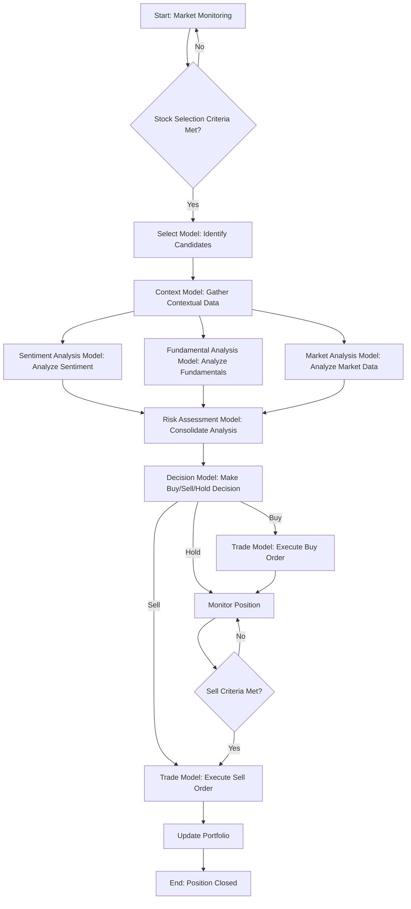

# NextGen Trading Process Flow

This document outlines the end-to-end process flow of the NextGen automated trading system, from initial stock selection to trade execution and position management.

## Process Flowchart

## Detailed Process Explanation

The NextGen trading system operates through a series of interconnected models and MCP tools, orchestrated primarily by the `autogen_model`. The process can be broken down into the following key stages:

### 1. Stock Selection and Candidate Identification

The process begins with continuous market monitoring. The system, potentially driven by the `autogen_model` initiating a cycle, evaluates the market to identify potential trading opportunities.

*   **Criteria Evaluation:** The system checks if predefined stock selection criteria are met. These criteria can be based on various factors such as price movement, volume spikes, news events, or technical indicators. This initial screening might involve the `Market Analysis Model` or direct data feeds processed by the `autogen_model`.
*   **Candidate Identification (`select_model`):** If the criteria are met, the `select_model` is engaged. This model is responsible for identifying a universe of potential trading candidates. It interacts with:
    *   `TradingMCP`: To get account information like buying power, which might influence the types or quantities of stocks considered.
    *   `FinancialDataMCP`: To retrieve market data, quotes, and potentially unusual activity data (via underlying Polygon or Unusual Whales MCPs).
    *   `TimeSeriesMCP`: To calculate technical indicators or analyze price data for filtering and ranking candidates.
    *   `RedisMCP`: To store the list of selected candidates for other models to access and to receive feedback from other models about the quality of the candidates.
*   The `select_model` filters and ranks stocks based on liquidity, price, volume, and potentially initial technical signals or unusual activity detected through its MCP interactions. It then provides a list of promising candidates for further, more in-depth analysis.

### 2. Analysis and Buy Decision

Once a list of candidates is generated, the system proceeds with a comprehensive analysis phase involving multiple specialized models. This phase aims to gather sufficient information to make an informed decision on whether to buy a stock.

*   **Contextual Data Gathering (`context_model`):** For each candidate, the `context_model` is activated to gather relevant contextual information. This is crucial for providing background and supporting RAG (Retrieval Augmented Generation) for the analysis models. It interacts with:
    *   `DocumentAnalysisMCP`: To process financial documents (like earnings reports, press releases) and generate embeddings for retrieval.
    *   `VectorStoreMCP`: To store and retrieve document embeddings from the vector database.
    *   Various Data Source MCPs (via generic `fetch_data` or specific `use_*_tool` methods): To fetch news (Polygon News, Yahoo News), social media data (Reddit), and other relevant information.
    *   `RedisMCP`: For caching contextual data and managing feedback related to data relevance.
*   **Sentiment Analysis (`sentiment_analysis_model`):** The `sentiment_analysis_model` analyzes text data gathered by the `context_model` (news, social media) to determine the sentiment surrounding the candidate stocks and related entities. It interacts with:
    *   `FinancialDataMCP` (which includes sentiment analysis capabilities): To perform entity extraction and sentiment scoring.
    *   `RedisMCP`: To cache sentiment data and publish sentiment analysis reports to a Redis stream for consumption by other models, particularly the `Decision Model` and `Risk Assessment Model`. It also sends feedback to the `select_model`.
*   **Fundamental Analysis (`fundamental_analysis_model`):** The `fundamental_analysis_model` evaluates the financial health and intrinsic value of the candidate companies. It interacts with:
    *   `FinancialDataMCP`: To retrieve financial statements, market data, and earnings reports (via underlying Polygon or Yahoo Finance MCPs).
    *   `RiskAnalysisMCP`: To calculate key financial ratios, score financial health, analyze growth trends, and calculate valuation metrics.
    *   `RedisMCP`: For caching fundamental data and sending analysis reports to the `Decision Model` via streams. It also sends feedback to the `select_model`.
*   **Market Analysis (`market_analysis_model`):** The `market_analysis_model` performs technical analysis on the market data related to the candidates. It interacts with:
    *   `FinancialDataMCP`: To retrieve historical and real-time market data (via underlying Polygon MCPs).
    *   `TimeSeriesMCP`: To calculate technical indicators, detect chart patterns, and identify support and resistance levels.
    *   `RedisMCP`: For caching market data and scan results, and sending analysis reports to the `Decision Model` via streams. It also sends feedback to the `select_model`.
*   **Risk Consolidation (`risk_assessment_model`):** While the other analysis models are working, the `risk_assessment_model` begins to consolidate the incoming analysis reports. It acts as a central hub for risk information. It interacts with:
    *   `RiskAnalysisMCP`: For core risk calculations, scenario generation, and attribution.
    *   `RedisMCP`: For state management, storing risk data, monitoring risk limits, and inter-model communication. It reads reports from the `Sentiment Analysis Model`, `Fundamental Analysis Model`, and `Market Analysis Model` from their respective Redis streams/keys.
*   **Decision Making (`decision_model`):** The `decision_model` is the final arbiter. It aggregates the analysis results from all other models (`select_model`, `sentiment_analysis_model`, `fundamental_analysis_model`, `market_analysis_model`, `risk_assessment_model`). It considers portfolio constraints, current market conditions (potentially via `FinancialDataMCP`), and applies predefined risk management rules (potentially via `RiskAnalysisMCP`). Based on this comprehensive input, it makes a final trading decision: buy, sell, or hold. It provides a confidence level and reasoning for its decision. It interacts with:
    *   `RiskAnalysisMCP`: For decision analytics, portfolio optimization, and drift detection.
    *   `FinancialDataMCP`: For market data needed for market state evaluation.
    *   `RedisMCP`: For inter-model communication, storing decisions, and retrieving data from other models. It reads analysis reports from other models via Redis streams/keys.
    *   `ContextModel`: For RAG functionality to support its decision-making process.

### 3. Trade Execution and Position Management

If the `decision_model` determines that a stock should be bought, the process moves to the execution and subsequent position management phase.

*   **Trade Execution (`trade_model`):** The `trade_model` receives the buy decision from the `decision_model` and is responsible for executing the trade on the trading platform (Alpaca). It interacts with:
    *   `TradingMCP`: For all core trading functionality, including submitting buy orders, managing positions, and retrieving account information.
    *   `FinancialDataMCP`: For retrieving real-time market data like the latest quotes needed for monitoring execution and positions.
    *   `TimeSeriesMCP`: Potentially used for analysis like slippage calculation during execution or identifying short-term price movements.
    *   `RedisMCP`: For state management (e.g., tracking daily capital usage), monitoring open positions, and publishing trade events and account/position updates to streams/keys for other models (like the `risk_assessment_model`) to consume.
*   **Position Monitoring:** Once a position is open, the system continuously monitors it. This monitoring involves:
    *   The `trade_model` tracking the status of open orders and positions via the `TradingMCP` and publishing updates to Redis.
    *   The `risk_assessment_model` monitoring trade events from the `trade_model` via Redis streams to update its internal portfolio state and recalculate risk metrics.
    *   Potentially the `Market Analysis Model` or `TimeSeriesMCP` continuously analyzing the price movement of the held stock.
*   **Sell Decision:** The decision to sell a stock is also made by the `decision_model`, based on updated analysis and predefined exit criteria. These criteria can include:
    *   Profit targets being reached.
    *   Stop-loss limits being hit.
    *   Changes in fundamental outlook.
    *   Negative sentiment shifts.
    *   Deterioration of technical indicators.
    *   Changes in overall market conditions or risk assessment from the `risk_assessment_model`.
    *   The `decision_model` receives updated analysis from the other models (Sentiment, Fundamental, Market, Risk) via Redis streams and re-evaluates the position.
*   **Sell Execution (`trade_model`):** If the `decision_model` issues a sell decision, the `trade_model` executes the sell order through the `TradingMCP`.
*   **Portfolio Update:** After a position is closed (either by selling or other means), the system updates its internal portfolio state, often managed and tracked via the `RedisMCP` and monitored by the `risk_assessment_model`.

This iterative process of selection, analysis, decision, execution, and monitoring allows the NextGen system to dynamically respond to market conditions and manage its trading activities.